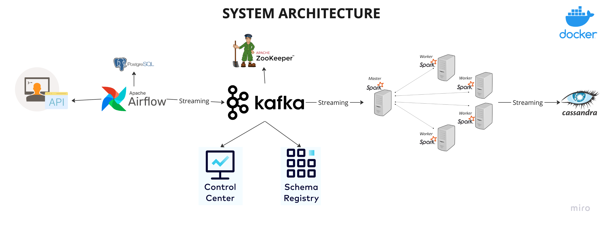

# Real-Time Streaming Data Pipeline

)

## Overview

This project demonstrates a **real-time end-to-end data engineering pipeline** built using modern tools and best practices.

It simulates continuous data ingestion from an external API, streams it through Kafka, processes it using Spark Structured Streaming, and stores the transformed data into Cassandra.

---

##  Architecture

The pipeline follows this flow:

**API → Airflow → Kafka → Spark (Streaming) → Cassandra**

### 🔧 Components:

* **Producer (API Ingestion)**
  Fetches real-time data from `randomuser.me API`

* **Apache Airflow**
  Orchestrates and schedules the pipeline

* **Apache Kafka**
  Acts as a distributed streaming platform for real-time data

* **Apache Spark (Structured Streaming)**
  Processes streaming data in real time

* **Apache Cassandra**
  Stores processed data for fast querying

* **Docker**
  Containerizes the entire pipeline

---

## ⚙️ Tech Stack

* Python
* Apache Kafka
* Apache Airflow
* Apache Spark (Structured Streaming)
* Cassandra
* Docker & Docker Compose

---

## 📁 Project Structure

```bash
.
├── dags/
│   └── orchestration.py
├── producer/
│   └── producer.py
├── script/
│   └── entrypoint.sh
├── docker-compose.yml
├── requirements.txt
├── Data engineering architecture.png
|__ Spark_stream.py
└── README.md
```

---

## 🚀 Getting Started

### 🔹 1. Clone Repository

```bash
git clone https://github.com/<your-username>/real-time-streaming-pipeline.git
cd real-time-streaming-pipeline
```

---

### 🔹 2. Start All Services

```bash
docker-compose up -d
```

---

### 🔹 3. Create Kafka Topic

```bash
docker exec -it <kafka_container> kafka-topics \
--create \
--topic random_users \
--bootstrap-server localhost:9092 \
--partitions 3 \
--replication-factor 1
```

---

### 🔹 4. Run Producer

```bash
python producer/producer.py
```

---

### 🔹 5. Start Airflow

* Open: http://localhost:8080
* Trigger DAG: `kafka_stream_pipeline`

---

### 🔹 6. Run Spark Streaming Job

```bash
python script/spark_stream.py
```

---

### 🔹 7. Verify Data in Cassandra

```bash
docker exec -it <cassandra_container> cqlsh
```

```sql
SELECT * FROM kafka_keyspace.users;
```

---

## 🔄 Data Flow Explanation

1. Data is continuously fetched from API
2. Producer sends data to Kafka topic
3. Kafka stores data in partitions
4. Spark reads data as a stream
5. Data is transformed and cleaned
6. Final output is stored in Cassandra

---

## 📊 Key Concepts Demonstrated

* Real-time data ingestion
* Event streaming using Kafka
* Partitioning and scalability
* Consumer groups and offsets
* Spark Structured Streaming
* Distributed NoSQL storage (Cassandra)
* Workflow orchestration with Airflow

---

## ⚠️ Notes

* `logs/` directory is ignored via `.gitignore`
* Ensure Docker is running before starting services
* Kafka topic must be created before running producer

---

## 🚀 Future Improvements

* Add Schema Registry (Avro/Protobuf)
* Implement Data Validation Layer
* Add Monitoring (Prometheus + Grafana)
* Deploy on Kubernetes
* Use Cloud Services (AWS MSK, Databricks)

---

## 🤝 Contributing

Feel free to fork this repo and improve it.

---

## ⭐ If you like this project

Give it a star ⭐ on GitHub!

---
